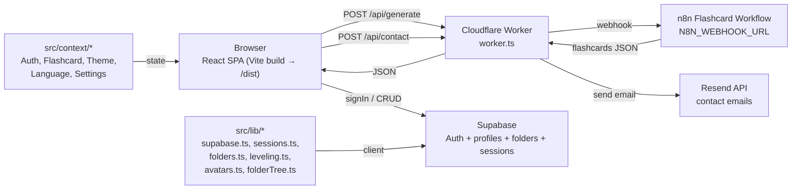

<p align="center">
  
</p>

<h1 align="center">StudySpark</h1>

<p align="center">
  Turn your study notes into interactive flashcards with AI — study, track progress, and level up.
</p>

<p align="center">
  
  
  
  
  <br />
  
  
  
  
  
  
  
</p>

---

## Overview

StudySpark is a modern single-page web app that connects to an [n8n](https://n8n.io) flashcard workflow to generate, study, and manage interactive flashcards from your study notes. It is deployed as a **Cloudflare Worker** that both serves the built React app and proxies AI generation + contact emails.

What you get:

- **AI-powered flashcard generation** from notes or uploaded files (PDF, TXT, DOCX)
- **Multiple study modes** (basic, timed, spaced repetition)
- **Folder-organized library** with a shared move-tree picker
- **Gamified progress** — XP, levels, and difficulty-weighted scoring
- **Auth & profiles** via Supabase (email/password + Google OAuth, password reset)
- **Custom avatars** (generated shapes/rings/identicons or uploaded photo, with cropper)
- **Built-in Chatbot** that guides users through topics via a decision-tree conversation
- **Export** sessions to CSV / JSON
- **Responsive UI** with framer-motion animations and light/dark theming + i18n
- **Contact form** that delivers messages over Resend

## Features

### 🎯 Core Features

1. **Smart Upload & Generation**
   - Drag & drop file upload (PDF, TXT, DOCX) or paste notes directly
   - Real-time progress while n8n generates cards
   - Error handling and validation

2. **Interactive Study Experience**
   - Click-to-reveal flashcards
   - Multiple study modes and session configuration
   - Progress tracking, timers, and performance analytics
   - Gamified XP and leveling

3. **Library & Organization**
   - Folders persisted in Supabase
   - Shared `FolderTreePicker` to move decks anywhere in the tree
   - Multi-select and recursive card counts

4. **Export & Sharing**
   - CSV / JSON export of sessions
   - Shareable study links

5. **Modern UI/UX**
   - Responsive design (mobile + desktop)
   - framer-motion animations and transitions
   - Light/dark theme + language switching (i18n)
   - Accessibility focused

### 🔧 Technical Features

- **React 18** + **TypeScript** (strict)
- **Vite 6** for dev and production builds
- **Tailwind CSS 3** for styling
- **Supabase Auth** (email/password, Google OAuth, password reset)
- **Cloudflare Worker** (serves SPA + proxies `/api/generate` and `/api/contact`)
- **n8n Workflow Integration** for AI flashcard generation
- **Resend** for transactional contact emails
- **Context-based state** (Auth, Flashcard, Theme, Language, Settings)
- **framer-motion**, **lucide-react**, **react-dropzone**, **react-router-dom**

## Architecture



## Getting Started

### Prerequisites

- Node.js 18+ (npm)
- Git
- A running **n8n** instance with the flashcard generation workflow
- A **Supabase** project (auth + database)
- A **Cloudflare** account (for Worker deployment)

### Installation

```bash
# Clone the repository
git clone https://github.com/M4rc0s-Dev/StudySpark.git
cd StudySpark

# Install dependencies
npm install

# Configure environment variables
cp .env.example .env   # (or create .env — see Configuration below)
# Edit .env with your Supabase credentials

# Start the development server
npm run dev
# The app will be available at http://localhost:5173
```

### Local API proxy (optional)

In development the client calls `VITE_API_BASE_URL` (defaults to `http://localhost:3001`).
To run the Worker locally, use Wrangler:

```bash
npm install -g wrangler
wrangler dev        # serves the SPA + /api/* from worker.ts against ./dist
```

## Project Structure

```
.
├── src/
│   ├── components/
│   │   ├── Chatbot/          # Decision-tree study assistant (Chatbot.tsx)
│   │   ├── Features/         # Flashcard, UploadArea, StudyModeSelector, LoadingScreen
│   │   ├── Layout/           # Layout, AvatarCropper, AvatarPicker, FolderTreePicker,
│   │   │                     #   ProfileMenu, ConfirmDialog, ContextMenu, ErrorBoundary,
│   │   │                     #   PasswordStrength
│   │   ├── Study/            # ProgressBar, Timer, SessionConfigModal
│   │   └── UI/               # Atomic UI elements
│   ├── context/             # React context providers
│   │   ├── AuthContext.tsx
│   │   ├── FlashcardContext.tsx
│   │   ├── ThemeContext.tsx
│   │   ├── LanguageContext.tsx
│   │   └── SettingsContext.tsx
│   ├── data/                # Static data (e.g. sampleDeck.ts)
│   ├── lib/                 # Utility/business logic
│   │   ├── supabase.ts      # Supabase client
│   │   ├── sessions.ts      # Session persistence
│   │   ├── folders.ts       # Folder sync with Supabase
│   │   ├── folderTree.ts    # Move-tree building helpers
│   │   ├── leveling.ts      # XP / level calculations
│   │   ├── avatars.ts       # Avatar token generation
│   │   ├── colors.ts        # Color tokens
│   │   └── export.ts        # CSV / JSON export
│   ├── pages/               # Route pages (Home, Library, Study, Auth, Settings, Contact, …)
│   ├── services/            # API service layer (apiService.ts)
│   ├── types/               # TypeScript type definitions (index.ts)
│   └── utils/               # Small helpers (cn.ts)
├── public/                  # Static assets
├── docs/                    # Project documentation
├── worker.ts                # Cloudflare Worker entry point
├── wrangler.json           # Cloudflare Worker config
├── package.json            # Dependencies and scripts
├── vite.config.ts          # Build configuration
├── tsconfig.json           # TypeScript configuration
├── tailwind.config.js      # Tailwind configuration
├── README.md               # This file
└── web-app-structure.md    # Detailed project structure
```

> Note: the earlier README referenced `store/` and `hooks/` directories and a
> `GumroadService.js` — none of those exist in the current codebase. State is
> managed through React Context (in `src/context/`), and there is no Gumroad
> integration.

## Key Components

### 1. Chatbot (`components/Chatbot/Chatbot.tsx`)

A built-in study assistant that walks users through topics using a
**decision-tree conversation** (no free-text input — each option returns a
curated, correct answer plus follow-up questions). Uses `framer-motion`
for animated transitions and respects the active language via `LanguageContext`.

### 2. UploadArea (`components/Features/UploadArea.tsx`)

The main interface for creating decks. Supports:
- File drag & drop (PDF, TXT, DOCX) via `react-dropzone`
- Direct text/notes input
- File preview and validation
- Progress indication while n8n generates cards

### 3. Flashcard (`components/Features/Flashcard.tsx`)

Interactive flashcard with:
- Question/answer toggle
- Difficulty indicators (mapped to a 5-level scale)
- Smooth animations and responsive design

### 4. FolderTreePicker (`components/Layout/FolderTreePicker.tsx`)

Shared, recursive folder selector used by the "Move" menu and deck organization.
Excludes the current folder from its own move targets and shows the full tree.

### 5. AvatarCropper / AvatarPicker (`components/Layout/AvatarCropper.tsx`, `AvatarPicker.tsx`)

Lets users pick a generated avatar (`avatars.ts` styles: shapes, rings,
identicon) or upload and crop a photo. Result is stored on the Supabase
`profiles.avatar` column.

### 6. Study session components (`components/Study/*`)

- `Timer.tsx` — countdown / elapsed time for timed study modes
- `ProgressBar.tsx` — visual progress
- `SessionConfigModal.tsx` — configure a study session

### 7. API Service (`services/apiService.ts`)

Integration layer that talks to the Worker's `/api/generate` endpoint:
- Flashcard generation (with difficulty normalization)
- Session management
- File upload handling
- Export support
- Error handling

## Configuration

### Environment Variables

The **frontend** only needs the Supabase public (publishable) keys — Supabase
handles auth server-side:

```env
# .env  (client-side, browser-safe publishable keys)
VITE_SUPABASE_URL=https://nhxkubdzpnceyoemtliu.supabase.co
VITE_SUPABASE_ANON_KEY=your-anon-or-publishable-key

# Optional — base URL for the API proxy (defaults to http://localhost:3001)
VITE_API_BASE_URL=/api
```

The **Cloudflare Worker** reads its secrets from `wrangler.json` `vars` (or
Wrangler secrets) — these are never shipped to the browser:

```jsonc
// wrangler.json
{
  "vars": {
    "N8N_WEBHOOK_URL": "https://n8n.marcos-valera.pp.ua/webhook/flashcard-api",
    "CONTACT_TO": "valera08marcos.trabajo@gmail.com"
    // RESEND_API_KEY is provided as a Wrangler secret for email delivery
  }
}
```

| Variable | Where | Purpose |
| --- | --- | --- |
| `VITE_SUPABASE_URL` | client `.env` | Supabase project URL |
| `VITE_SUPABASE_ANON_KEY` | client `.env` | Supabase publishable/anon key |
| `VITE_API_BASE_URL` | client `.env` | API proxy base (optional) |
| `N8N_WEBHOOK_URL` | Worker var | n8n flashcard generation webhook |
| `CONTACT_TO` | Worker var | Destination email for contact form |
| `RESEND_API_KEY` | Worker secret | Resend API key for contact emails |

### Supabase Auth Setup (Supabase + Resend + Google)

StudySpark uses Supabase Auth (email/password, password reset, and Google
OAuth). The frontend only needs the public anon key — Supabase does the rest
server-side.

#### 1. Supabase project

1. Create a project at <https://supabase.com> (StudySpark's project id is
   `nhxkubdzpnceyoemtliu`, region `eu-central-1`).
2. Copy **Project Settings → API → Project URL** and the **anon/public key**
   into `.env` (see above).
3. Apply the database schema. The `profiles` table already exists; add the
   `avatar` column used by the avatar picker:

   ```sql
   ALTER TABLE public.profiles ADD COLUMN IF NOT EXISTS avatar text NULL;
   ```
4. **Row Level Security** — confirm these owner-only policies exist on
   `profiles`:

   ```sql
   CREATE POLICY "Profiles are viewable by owner"
     ON public.profiles FOR SELECT USING (auth.uid() = id);
   CREATE POLICY "Profiles are editable by owner"
     ON public.profiles FOR UPDATE USING (auth.uid() = id);
   CREATE POLICY "Profiles are insertable by owner"
     ON public.profiles FOR INSERT WITH CHECK (auth.uid() = id);
   ```

#### 2. Resend (transactional email for password reset)

1. Create an account at <https://resend.com> and verify your domain
   (StudySpark uses `studyspark.pp.ua`).
2. In Resend → **API Keys**, generate a key.
3. In Supabase → **Authentication → Providers → Email**, pick **Resend** as the
   provider and paste the Resend API key.
4. Set the **Redirect URLs** (Supabase → Authentication → URL Configuration):
   - Site URL: `https://your-domain` (e.g. `https://studyspark.pp.ua`)
   - Redirect URLs (add both):
     - `https://your-domain/auth/confirm`
     - `http://localhost:5173/auth/confirm` (local dev)
5. (Optional) Customize the email template under **Authentication →
   Email Templates → Reset Password** so the link points to
   `/auth/confirm?token_hash=...&type=recovery`. StudySpark reads that page,
   verifies the OTP and shows a "set new password" form.

> Without a provider (steps 2–3) Supabase still works locally but the reset
> email is never sent, so the "forgot password" button appears to do nothing.

#### 3. Google OAuth (sign in with Google)

1. Google Cloud Console → **APIs & Services → Credentials → OAuth 2.0 Client ID**.
   - Application type: **Web application**.
   - Authorized redirect URI: `https://nhxkubdzpnceyoemtliu.supabase.co/auth/v1/callback`.
2. Supabase → **Authentication → Providers → Google**: enable it and paste the
   Google **Client ID** and **Client Secret**.
3. The "Continuar con Google" button calls `supabase.auth.signInWithOAuth({ provider: 'google' })`.
   After the redirect back, `onAuthStateChange` recreates the `profiles` row if
   needed (reading the name from `user_metadata`), so Google users get an avatar
   and profile automatically.

#### How the code wires it

- `src/lib/supabase.ts` — creates the client from the `VITE_*` env vars.
- `src/context/AuthContext.tsx` — `signIn`, `signUp`, `signInWithGoogle`,
  `updatePassword`, `resetPassword`, `ensureProfile`.
- `src/pages/AuthPage.tsx` — login/register form, Google button, forgot-password.
- `src/pages/ConfirmPage.tsx` — handles `type=signup` (email confirmation)
  and `type=recovery` (password reset) from the email links.
- `src/pages/ResetPasswordPage.tsx` — "set new password" form after reset.

## Deployment (Cloudflare Workers)

StudySpark is deployed as a Cloudflare Worker. `worker.ts` does two jobs:

1. **`POST /api/generate`** → forwards the notes to the n8n webhook
   (`N8N_WEBHOOK_URL`) and returns the flashcards JSON.
2. **`POST /api/contact`** → sends the contact-form message via Resend
   (`RESEND_API_KEY`) to `CONTACT_TO`.
3. **Everything else** → serves the built React app from the `./dist` assets
   binding, with SPA fallback (`not_found_handling: single-page-application`).

```bash
# Build the frontend
npm run build

# Deploy the Worker (serves ./dist + /api/*)
wrangler deploy
```

`wrangler.json` is already configured with the asset directory (`./dist`),
SPA fallback, and the `N8N_WEBHOOK_URL` / `CONTACT_TO` vars. Set the
`RESEND_API_KEY` secret with:

```bash
wrangler secret put RESEND_API_KEY
```

> The old `functions/api/generate.ts` (Cloudflare Pages style) is obsolete —
> the Worker in `worker.ts` replaces it.

## Development Scripts

```json
{
  "scripts": {
    "dev": "vite",
    "build": "tsc && vite build",
    "lint": "eslint . --ext .ts,.tsx,.js,.jsx",
    "preview": "vite preview"
  }
}
```

| Command | Description |
| --- | --- |
| `npm run dev` | Start the Vite dev server (http://localhost:5173) |
| `npm run build` | Type-check and build for production into `dist/` |
| `npm run lint` | Lint the codebase with ESLint |
| `npm run preview` | Preview the production build locally |

## Troubleshooting

### Flashcard generation not working
- Verify the n8n workflow is **active** and `N8N_WEBHOOK_URL` (Worker var) is correct.
- Check the browser console and the Worker logs (`wrangler tail`).
- Confirm the request reaches `POST /api/generate`.

### Auth / password reset not working
- Ensure `VITE_SUPABASE_URL` and `VITE_SUPABASE_ANON_KEY` are set in `.env`.
- The reset email requires a configured email provider (Resend) in Supabase —
  without it the button appears to do nothing.
- Verify the Supabase redirect URLs include `/auth/confirm`.

### Study / library issues
- Check that `profiles`, `folders`, and `sessions` are correctly persisted in
  Supabase and that RLS policies allow owner access.

## Performance Optimization

- Vite splits the bundle via `manualChunks` (vendor, router, utils, ui).
- Run `npm run build` and inspect `dist/` for bundle size.
- Source maps are enabled (`sourcemap: true`) for production debugging.

## Security Considerations

- **Public keys only in the frontend**: only the Supabase anon/publishable key
  is exposed; all auth happens server-side in Supabase.
- **Worker secrets**: `RESEND_API_KEY` is a Wrangler secret, never bundled.
- **RLS**: Supabase Row Level Security policies enforce owner-only access.
- **Input validation** on both the contact and generate endpoints in `worker.ts`.
- **HTTPS only** in production (Cloudflare terminates TLS).

## Contributing

1. Create a feature branch off `main`.
2. Make your changes with clear, descriptive commits.
3. Run `npm run lint` and `npm run build` before pushing.
4. Open a pull request; request review before merge.

## Version Tracking

| Version | Commit | Notes |
| --- | --- | --- |
| **1.0.0** | [`fc4f07c`](https://github.com/M4rc0s-Dev/StudySpark/commit/fc4f07c) | Current release — bug fixes (move tree, review XP, multi-select, recursive card count) |
| — | [`f160d2e`](https://github.com/M4rc0s-Dev/StudySpark/commit/f160d2e) | Bug fixes (move tree, pending/wrong review XP, % clarity) |
| — | [`7c650ed`](https://github.com/M4rc0s-Dev/StudySpark/commit/7c650ed) | Fix build errors (translation keys, move menu) |
| — | [`e8063fc`](https://github.com/M4rc0s-Dev/StudySpark/commit/e8063fc) | Bug fixes + n8n Gemma fixes + email templates |
| — | [`7017b74`](https://github.com/M4rc0s-Dev/StudySpark/commit/7017b74) | Fix crash in Library + Move menu tree |

Full history: <https://github.com/M4rc0s-Dev/StudySpark/commits/main>

## License

This project is licensed under the **MIT License**.

## Acknowledgments

- [n8n](https://n8n.io) for the workflow automation platform
- [Supabase](https://supabase.com) for auth and database
- [Cloudflare](https://workers.cloudflare.com) for Workers deployment
- [Resend](https://resend.com) for transactional email
- The React, Vite, Tailwind CSS, and framer-motion teams
- All open-source contributors who made this possible

---

*Last updated: July 15, 2026*
*Version: 1.0.0*

Questions, suggestions, or feedback? Open an issue or reach out — we're excited
to help you build a better flashcard study experience.
